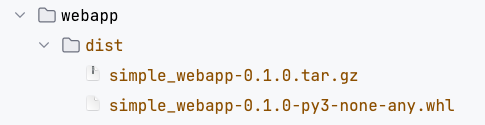
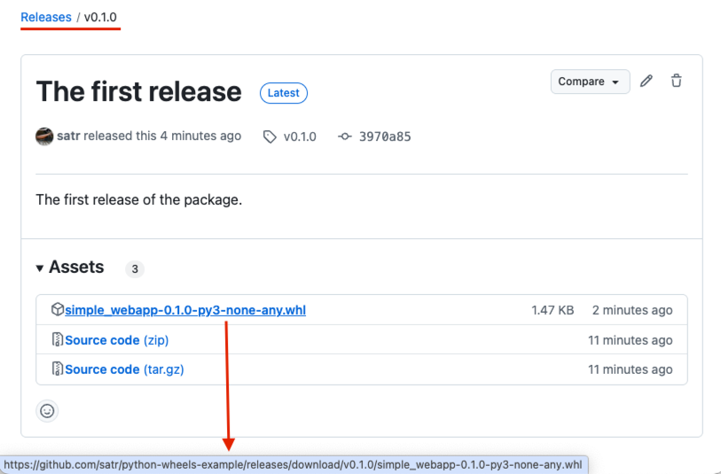

# Example

## Build and run the webapp in docker with local dist folder
* Build the webapp wheel package using the following command:
```bash
cd ./webapp
python3 -m pip install --upgrade setuptools wheel build
python3 -m build
```
* This generates a wheel file (.whl) in dist/ folder:
```bash
ls -l dist/
```

* Build the docker image with the local dist folder:
```bash
docker build -t simple-webapp:using-local-dist . -f Dockerfile.using-local-dist
```
* Run the docker image and open the webapp in your browser [http://localhost:8000](http://localhost:8000):
```bash
docker run -it -p 8000:8000 simple-webapp:using-local-dist
```

## Publish the wheel to GitHub packages
* Build the webapp wheel package using the following command:
```bash
cd ./webapp
python3 -m pip install --upgrade setuptools wheel build
python3 -m build
```
* Authorize the GitHub CLI to access your GitHub account:
```bash
gh auth login
```
* Create the GitHub release
```bash
gh release create v0.1.0 \
  --title "The first release" \
  --notes "The first release of the package." \               
  --repo YOUR_USER/python-wheels-example
```
* Output - the release link:
```bash
https://github.com/YOUR_USER/python-wheels-example/releases/tag/v0.1.0
```
* You can see releases names in the GitHub repository:
```bash
gh release list --repo YOUR_USER/python-wheels-example
```
* Upload the package
```bash
gh release upload v0.1.0 dist/simple_webapp-0.1.0-py3-none-any.whl --repo YOUR_USER/python-wheels-example
```
* Release will contain the wheels


* Build the docker image with wheel using the GitHub package:
```bash
docker build -t simple-webapp:using-public-wheel-in-gh-package . -f Dockerfile.using-private-wheel-in-gh-package
```
* Run the docker image and open the webapp in your browser [http://localhost:8000](http://localhost:8000):
```bash
docker run -it -p 8000:8000 simple-webapp:using-public-wheel-in-gh-package
```
* When the wheel is in a private repository, user and token (with permits to pull the image/package) can be added to build secrets and used in the Dockerfile (see the [Dockerfile.using-private-wheel-in-gh-package](webapp/Dockerfile.using-private-wheel-in-gh-package)):
```bash
echo "my-git-user">/tmp/git-user.txt
echo "my-git-token">/tmp/git-token.txt
DOCKER_BUILDKIT=1 docker build . --secret id=GITHUB_USER,src=/tmp/git-user.txt  --secret id=GITHUB_TOKEN,src=/tmp/git-token.txt -t simple-webapp:using-private-wheel-in-gh-package -f Dockerfile.using-private-wheel-in-gh-package
rm /tmp/git-user.txt
rm /tmp/git-token.txt
```